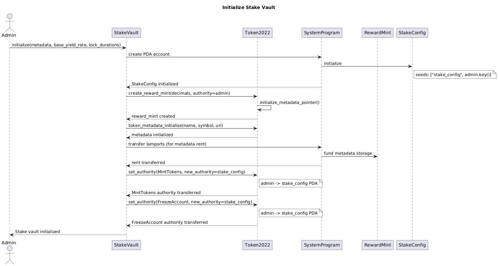
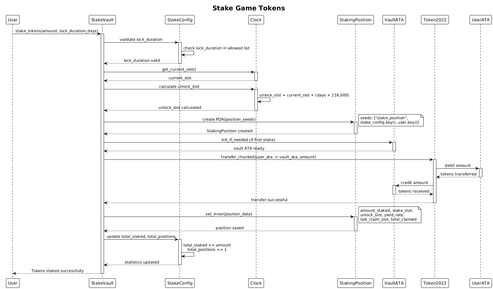
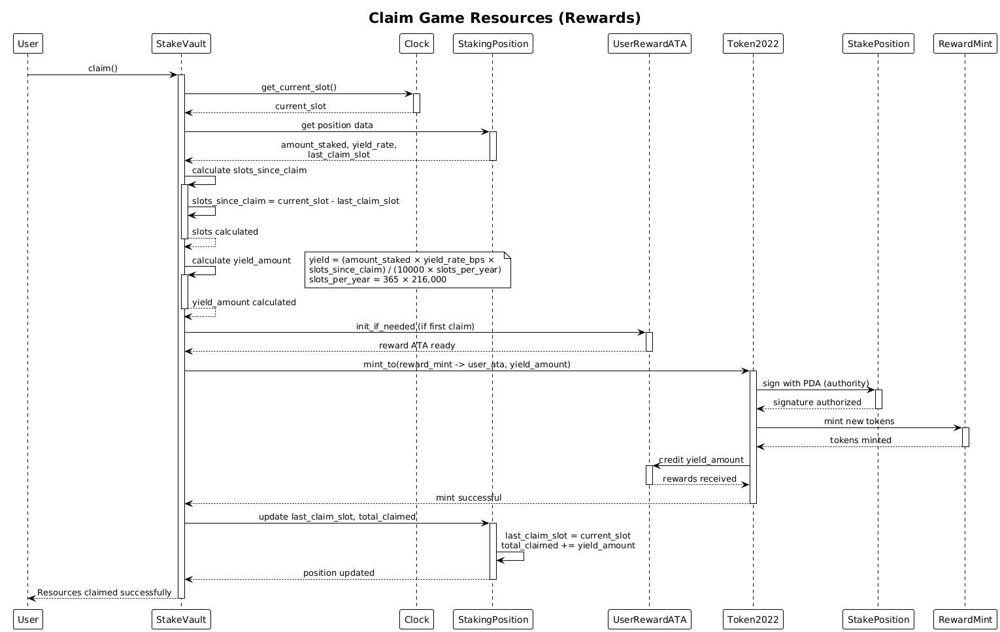

# SolMind SDK

A gaming SDK for Solana that enables token staking, resource generation, and P2P trading for Web3 games.

## Overview

SolMind SDK provides core infrastructure for blockchain games, starting with a Stake Vault that enables players to stake game tokens and receive game resources as rewards. The system leverages Solana's Token 2022 program with metadata extensions to create rich, on-chain game resources with full metadata support.

### Use Case Example
A player stakes 1000 game tokens for 30 days and receives game resources (e.g., resources, experience points) represented as Token 2022 tokens with full metadata. These resources can be used in-game or traded peer-to-peer with other players.

## Features

### Current (Stake Vault)
- ✅ **Game Token Staking**: Players lock game tokens for specified durations
- ✅ **Resource Generation**: Receive game resources as Token 2022 rewards
- ✅ **Claim Resources**: Players can claim accrued rewards based on staking time and yield rate
- ✅ **Token 2022 Integration**: Resource mints with metadata pointer extension
- ✅ **Flexible Lock Periods**: Configurable lock duration options (15, 30, 90 days)
- ✅ **On-Chain Tracking**: Individual staking positions tracked via PDAs
- ✅ **Rich Metadata**: Game resources with name, symbol, URI, and custom attributes

### Planned (P2P Trading)
- 🔄 **Peer-to-Peer Trading**: Direct player-to-player resource trading
- 🔄 **Order Book System**: Create and fill trading orders
- 🔄 **Marketplace Integration**: Seamless integration with game marketplaces
- 🔄 **Escrow System**: Secure trading with automatic settlement

## Architecture

### Programs

#### stake-vault (Current)
Main staking program for game token staking and resource generation:
- `initialize`: Set up vault and create game resource mint with Token 2022 metadata
- `stake_tokens`: Deposit game tokens and create staking position to earn resources
- `claim`: Claim accrued game resources based on staking duration and yield rate

#### p2p-trading (Planned)
Peer-to-peer trading system for game resources:
- `create_order`: Create buy/sell orders for game resources
- `fill_order`: Execute trades between players
- `cancel_order`: Cancel pending orders

### State Accounts

#### StakeConfig (PDA)
Global vault configuration for the game:
- Admin authority (game developer/DAO)
- Game token mint (what players stake)
- Resource mint (what players receive as rewards)
- Base yield rate (resource generation rate)
- Available lock durations (staking periods)
- Total staked amount and position count

#### StakingPosition (PDA)
Individual player staking position:
- Player wallet address
- Staked game token amount
- Stake and unlock slots
- Claim tracking (last_claim_slot, total_claimed)
- Yield rate for reward calculations

## Token 2022 Features

The reward mint utilizes Token 2022 extensions:

- **Metadata Pointer Extension**: On-chain metadata storage
- **Rich Metadata**: Name, symbol, and URI fields
- **Token Interface**: Compatible with Token 2022 ecosystem

## Getting Started

### Prerequisites

- Rust 1.70+
- Solana CLI 1.18+
- Anchor 0.32+
- Node.js 18+

### Installation

```bash
# Install Anchor
cargo install --git https://github.com/coral-xyz/anchor avm --locked --force
avm install latest
avm use latest

# Install dependencies
yarn install

# Build program
anchor build

# Run tests
anchor test
```

## Error Codes

- `InsufficientFunds`: User doesn't have enough tokens
- `InvalidLockDuration`: Selected lock duration not in allowed list
- `NoYieldAccrued`: No yield has been earned yet (claim called too early)

## Development

### Testing

```bash
# Run all tests
anchor test
```

## Documentation

- [Specifications](./docs/specifications.md) - User stories and detailed specifications

### Sequence Diagrams


*Initialize instruction flow - Creating vault and reward mint*


*Stake tokens instruction flow - Player staking game tokens*


*Claim resources instruction flow - Player claiming earned rewards based on yield calculation*

## Roadmap

### Phase 1: Stake Vault (Current)
- [x] Initialize vault with resource mint
- [x] Stake game tokens for resources
- [x] Claim resources instruction
- [ ] Unstake tokens instruction
- [ ] Variable yield rates by lock duration

### Phase 2: P2P Trading (Planned)
- [ ] Create trading orders (buy/sell resources)
- [ ] Order matching engine
- [ ] Execute trades with escrow
- [ ] Order cancellation
- [ ] Trading history and analytics

### Phase 3: Advanced Features (Future)
- [ ] Compound staking (re-stake resources)
- [ ] Automated reward distribution
- [ ] Resource fusion/crafting
- [ ] Marketplace integration
- [ ] Cross-game resource trading
